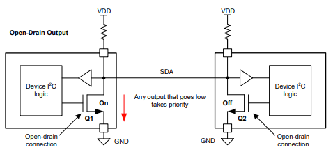
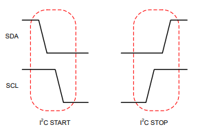
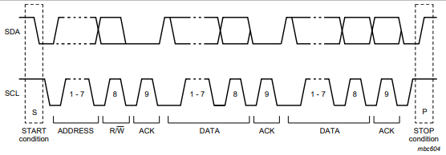

# Ejemplo de un driver I2C

## Descripción de la capa física

La capa física del I2C está compuesta por dos líneas, SDA y SCL. La línea SDA es la línea de datos y la línea SCL es la línea de reloj. Ambas líneas son bidireccionales y se utilizan para la comunicación entre el maestro y el esclavo.

Tanto SDA como SCL utilizan una configuración "open-collector" u "open drain", esto quiere decir, que existe una resistencia "pull-up" que conecta la línea a un voltaje positivo (Vcc) y los dispositivos pueden "tirar" de la línea a tierra (GND) para enviar un 0 lógico. Esto permite que múltiples dispositivos se conecten a la misma línea sin interferencias, ya que solo uno puede "tirar" de la línea a tierra al mismo tiempo. El 1 lógico se representa por la resistencia pull-up manteniendo la línea en alto y que no haya ningún dispositivo "tirando".



## Descripción del protocolo

### "Start" y "stop"

El I2C es un protocolo basado en transacciones. Todas las transacciones empiezan con un "start" y terminan con un "stop". Se puede continuar con una transacción enviando otro "start" en vez del "stop". 

El "start" se define como la transición de ALTO a BAJO de la línea SDA mientras que SCL se encuentra en ALTO, y el "stop", de BAJO a ALTO.



### Bytes

Los bytes enviados han de ser de 8 bits. El número de bytes que pueden transferirse por transacción no tiene límite. Cada byte tiene que ser seguido de un bit de confirmación (ACK) enviado por el receptor. Si el valor de este bit es 0, indica ACK, si es uno indica NACK. Cuando el maestro está recibiendo datos del esclavo, ha de contestar NACK para finalizar la transferencia.

### Dirección

Para referirse a un esclavo, después del "start" se envía un byte formado por los 7 bits de su dirección junto a un bit que indica escritura (0) o lectura (1).



## Implementación en Arduino

Para implementar el protocolo I2C mediante el framework de Arduino se han utilizado las funciones `pinMode(pin, mode)`, `digitalWrite(pin, value)`, `digitalRead(pin)` y `delayMicroseconds(us)`.

En el setup se establecen los dos pines a utilizar como SDA y SCL a 0 en modo `OUTPUT_OPEN_DRAIN`.

```c++
void setup() {
    pinMode(SCL, OUTPUT_OPEN_DRAIN);
    pinMode(SDA, OUTPUT_OPEN_DRAIN);
    digitalWrite(SDA, 0);
    digitalWrite(SCL, 0);
}
```

Entre todos los cambios de valores se incluye un periodo de estabilización mediante `delayMicroseconds(us)`

Para escribir un bit siguiendo el protocolo, se establece su valor en SDA, se sube el SCL y se baja el SCL.

Para recibir un bit, se pone SDA alto (abierto), se sube el SCL, se lee el valor de SDA y se baja el SCL.

```c++
void i2c_write_bit(bool value) {
    digitalWrite(SDA, value); wait();
    digitalWrite(SCL, 1); wait();
    digitalWrite(SCL, 0); wait();
}

bool i2c_read_bit() {
    digitalWrite(SDA, 1); wait();
    digitalWrite(SCL, 1); wait();
    bool value = digitalRead(SDA);
    digitalWrite(SCL, 0); wait();
    return value;
}
```

Para enviar "start" y "stop", se cambia SDA de alto a bajo o de bajo a alto, respectivamente, mientras SCL está alto, y se baja scl.

```c++
void i2c_start() {
    digitalWrite(SDA, 1); wait();
    digitalWrite(SCL, 1); wait();
    digitalWrite(SDA, 0); wait();
    digitalWrite(SCL, 0); wait();
}

void i2c_stop() {
    digitalWrite(SDA, 0); wait();
    digitalWrite(SCL, 1); wait();
    digitalWrite(SDA, 1); wait();
}
```

Por último, para enviar un byte se hace bit a bit, leyendo el ACK al final. Y para recibir un byte, también se hace bit a bit y se envía un ACK o un NACK al final.

```c++
bool i2c_write_byte(uint8_t data) {
    for (int i = 0; i < 8; i++) {
        i2c_write_bit(data & 0x80);
        data <<= 1;
    }
    return i2c_read_bit();
}

uint8_t i2c_read_byte(bool ack) {
    uint8_t data = 0;
    for (int i = 0; i < 8; i++) {
        data = (data << 1) | i2c_read_bit();
    }
    i2c_write_bit(!ack);
    return data;
}
```

## Uso del protocolo

Una vez implementado el protocolo, se puede utilizar para realizar comunicaciones con otros dispositivos, en este caso el BME280, un sensor de temperatura, humedad y presión.

La dirección de este sensor puede ser 0x76 o 0x77, en este caso see utiliza 0x76. Para comprobar que se puede realizar una conexión I2C, se puede leer del registro "id" (0xD0) del sensor de la siguiente forma: iniciando una transacción con un "start", escribiendo la dirección I2C del sensor (0x76) con el bit de escritura (0), escribiendo la dirección del registro (0xD0), continuando la transferencia con otro "start", escribiendo otra vez la dirección del registro pero esta vez con el bit de lectura (1), leyendo la contestación enviando un NACK para terminar con la transferencia y finalmente, terminando la transacción con un "stop". El resultado debería ser el ID 0x60.

```c++
uint8_t read_chip_id() {
    i2c_start();
    i2c_write_byte((0x76 << 1) | 0 /* WRITE */);
    i2c_write_byte(data);
    
    i2c_start());
    i2c_write_byte((0x76 << 1) | 1 /* READ */);
    uint8_t response = i2c_read_byte(false /* NACK */);
    i2c_stop();
    return response;
```

## Lectura de la temperatura

En esta sección se va a realizar la lectura de la temperatura en tres niveles de abstracción distintos: el driver implementado en las secciones anteriores, la librería Arduino Wire / ESP I2C y la librería de Adafruit para este sensor.

### Driver propio

Para obtener la temperatura es necesario realizar varios pasos: poner el sensor en modo sleep (para poder configurarlo), configurar el oversampling, cambiar a modo normal, leer los datos de calibración, leer los datos de temperatura sin ajustar y ajustarlos mediante la fórmula proporcionada.

```c++
#define ADDR 0x76
#define WRITE 0
#define READ 1
#define REG_CTRL_MEAS 0xF4
#define REG_CALIB_00 0x88
#define REG_TEMP 0xFA
#define MODE_SLEEP 0b00
#define MODE_NORMAL 0b11

uint32_t init_and_read_temperature() {
    // Poner el sensor en modo sleep
    i2c_start();
    i2c_write_byte((ADDR << 1) | WRITE);
    i2c_write_byte(REG_CTRL_MEAS);
    i2c_write_byte(MODE_SLEEP); // [1:0] = mode
    i2c_stop();
    
    // Configurar sobremuestreo de temperatura x1
    // y cambiar al modo normal
    i2c_start();
    i2c_write_byte((ADDR << 1) | WRITE);
    i2c_write_byte(REG_CTRL_MEAS);
    i2c_write_byte(0b001 << 5 | MODE_NORMAL); // [7:5] = ors_t
    i2c_stop();

    // Leer los datos de calibración (3 valores de 16 bits)
    uint8_t data;
    uint16_t dig_T1;
    int16_t dig_T2;
    int16_t dig_T3;
    
    i2c_start();
    i2c_write_byte((ADDR << 1) | WRITE);
    i2c_write_byte(REG_CALIB_00);
    i2c_start();
    i2c_write_byte((ADDR << 1) | READ);
    
    data = i2c_read_byte(true);
    dig_T1 = data;
    data = i2c_read_byte(true);
    dig_T1 |= data << 8;
    
    data = i2c_read_byte(true);
    dig_T2 = data;
    data = i2c_read_byte(true);
    dig_T2 |= data << 8;
    
    data = i2c_read_byte(true);
    dig_T3 = data;
    data = i2c_read_byte(true);
    dig_T3 |= data << 8;
    
    i2c_stop();
    
    // Leer la temperatura sin ajustar (12 bits)
    uint32_t temp;
    
    i2c_start();
    i2c_write_byte((ADDR << 1) | WRITE);
    i2c_write_byte(REG_TEMP);
    i2c_start();
    i2c_write_byte((ADDR << 1) | READ);
    
    data = i2c_read_byte(true);
    temp = data;
    temp <<= 8;
    data = i2c_read_byte(true);
    temp |= data
    temp <<= 4;
    data = i2c_read_byte(false);
    temp |= data >> 4;
    
    i2c_stop();    
    
    // Ajustar la temperatura
    temp = compensate_temperature(temp, dig_T1, dig_T2, dig_T33)
    
    // Temperatura en milesimas de ºC
    return temp;
}
```

### ESP32 HAL

Exspressif ofrece una librería para I2C con una API simple: `i2cInit(bus_num, sda, scl, clk_speed)`, `i2cWrite(bus_num, address, *buff, size, timeOutMillis)` y `i2cRead(bus_num, address, *buff, size, timeOutMillis, *readCount)`.

```c++
uint32_t init_and_read_temperature() {
    i2cInit(0, SDA, SCL, 100000);

    uint8_t buff;
    size_t err;

    // Poner el sensor en modo sleep
    buff = REG_CTRL_MEAS;
    i2cWrite(0, ADDR, &buff, 1, 10);
    buff = MODE_SLEEP;
    i2cWrite(0, ADDR, &buff, 1, 10);

    // Configurar sobremuestreo de temperatura x1
    // y cambiar al modo normal
    buff = REG_CTRL_MEAS;
    i2cWrite(0, ADDR, &buff, 1, 10);
    buff = 0b001 << 5 | MODE_NORMAL;
    i2cWrite(0, ADDR, &buff, 1, 10);

    // Leer los datos de calibración (3 valores de 16 bits)
    uint16_t dig_T1;
    int16_t dig_T2;
    int16_t dig_T3;
    
    buff = REG_CALIB_00;
    i2cWrite(0, ADDR, &buff, 1, 10);
    i2cRead(0, ADDR, &buff, 1, 10, &err);
    dig_T1 = buff;
    i2cRead(0, ADDR, &buff, 1, 10, &err);
    dig_T1 |= buff << 8;
    i2cRead(0, ADDR, &buff, 1, 10, &err);
    dig_T2 = buff;
    i2cRead(0, ADDR, &buff, 1, 10, &err);
    dig_T2 |= buff << 8;
    i2cRead(0, ADDR, &buff, 1, 10, &err);
    dig_T3 = buff;
    i2cRead(0, ADDR, &buff, 1, 10, &err);
    dig_T3 |= buff << 8;
    
    // Leer la temperatura sin ajustar (12 bits)
    i2cWrite(0, ADDR, &buff, 1, 10);
    i2cRead(0, ADDR, &buff, 1, 10, &err);
    uint32_t temp = buff;
    temp <<= 8;
    i2cRead(0, ADDR, &buff, 1, 10, &err);
    temp |= buff;
    temp <<= 4;
    i2cRead(0, ADDR, &buff, 1, 10, &err);
    temp |= buff >> 4;

    // Ajustar la temperatura
    temp = compensate_temperature(temp, dig_T1, dig_T2, dig_T33)
        
    // Temperatura en milesimas de ºC
    return temp;
```

### Adafruit BME280

La última capa de abstracción